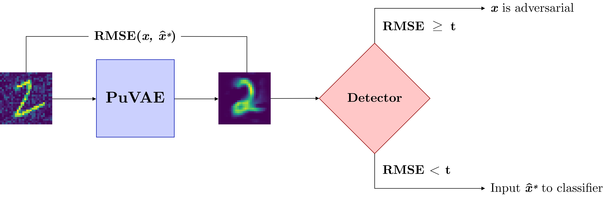

# Augmenting Robustness Using Adversarial Detection

This project was part of my Bachelor's thesis in 2020. It builds upon the work of [Hwang et al. (2019)](https://arxiv.org/abs/1903.00585) on PuVAE, a conditional variational autoencoder (CVAE) used for preprocessing (potentially adversarial) image inputs before feeding them to a classifier. Our work extends the PuVAE architecture by introducing a detection mechanism inspired by the earlier work of [Meng and Chen (2017)](https://arxiv.org/abs/1705.09064) on MagNet. This mechanism aims to identify and discard adversarially perturbed inputs before they reach the classifier.

We found that the detection mechanism improved robustness against FGSM and PGD attacks on simple datasets like MNIST and Fashion-MNIST. For more details, feel free to check out the associated paper.
